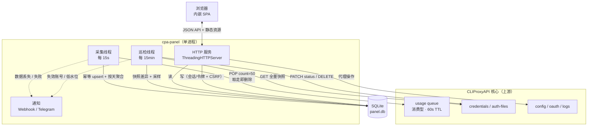
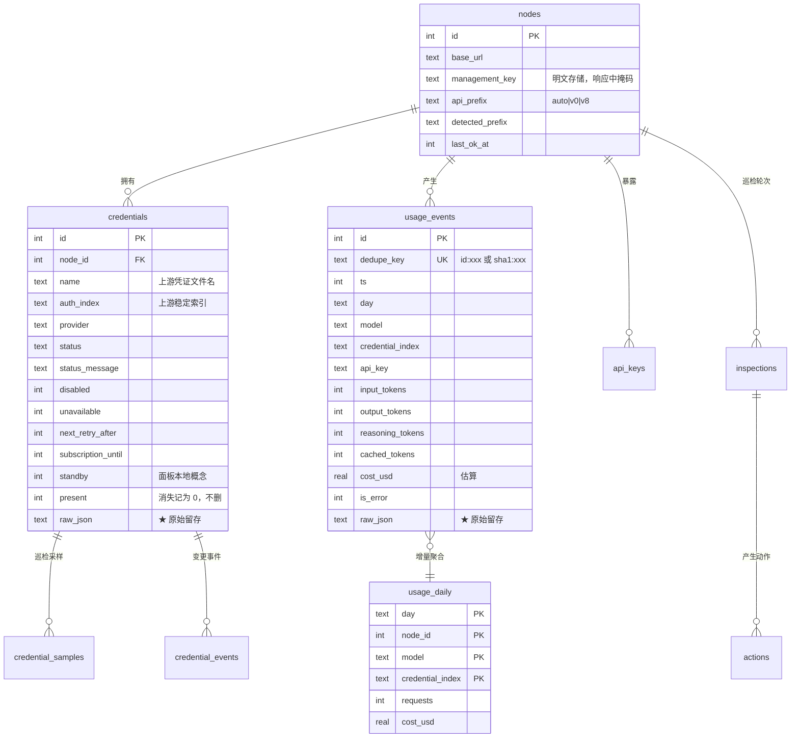
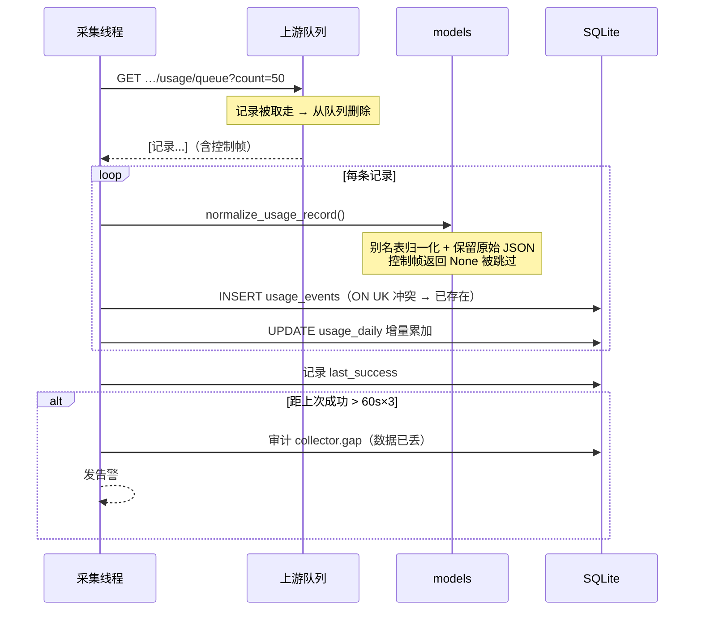
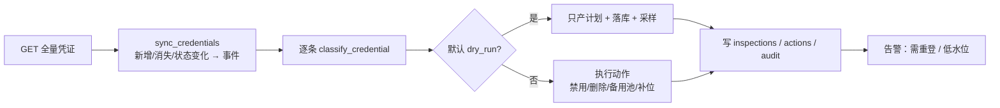
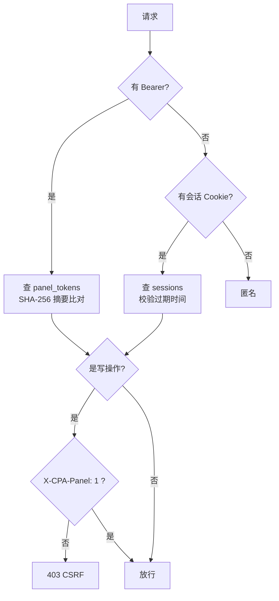

# 架构与数据模型

## 一句话

单进程、零依赖、四个线程：**HTTP 服务 + 用量采集 + 账号巡检 + 你的浏览器**，中间隔着一个 SQLite。

---

## 目录职责

| 模块 | 职责 | 不该做的事 |
| --- | --- | --- |
| `config.py` | 配置分层合并、路径解析、对外脱敏 | 不碰网络、不碰数据库 |
| `store.py` | 唯一的数据出入口：建表/迁移/DAO | 不做业务判断（例如「什么算失效」） |
| `cpa.py` | 上游 API 客户端：路径映射、鉴权、错误语义 | 不落库、不做自动决策 |
| `models.py` | 归一化与状态机：原始数据 → 规范模型 | 不访问数据库与网络 |
| `collector.py` | 采集循环：pop → 归一化 → 落库 → 间隙检测 | 不主动改上游 |
| `inspector.py` | 巡检：分类 → 计划 → 执行 → 审计 | 不采集用量 |
| `web/server.py` | HTTP 路由、鉴权、静态资源、指标 | 不直接写 SQL（走 store） |
| `runtime.py` | 装配（CLI 与测试共用） | 不含业务逻辑 |

这条边界不是洁癖：**端到端测试能跑通，正是因为它能拿同一份 `runtime.build()` 去组装一个真实的面板**，
而不是去 mock 一堆内部函数。

---

## 线程模型

| 线程 | 频率 | 阻塞行为 |
| --- | --- | --- |
| HTTP（每请求一个线程） | 按需 | 调上游时最多阻塞 `http.read_timeout`（默认 20s） |
| 采集 | 15s | 单轮失败只记日志，绝不让线程退出 |
| 巡检 | 15min（启动后先等 30s，避免与应用启动抢资源） | 同上 |
| （SQLite） | — | `check_same_thread=False` + 可重入锁；WAL 模式，读写不互相饿死 |

**为什么采集必须比 60 秒快很多**：上游队列是消费型且 60 秒过期。
如果采集间隔接近 60 秒，任何一次网络抖动都会导致永久丢数据。
15 秒给了 4 倍的容错余量；即使连续 3 次失败，也还来得及。

---

## 数据模型

### 几个刻意的设计

**1. `usage_events` 与 `usage_daily` 并存**
明细用于「查一条具体请求」，日聚合用于「画图/排行」。
聚合是**写入时增量累加**的，所以看报表不需要扫全表——
面板要在手机上打开，不能每次点开就做一次全表 GROUP BY。

**2. 凭证消失不删除，只标 `present = 0`**
上游删掉一个凭证后，你依然需要能回答「它是什么时候消失的、消失前什么状态」。
删除用户的历史账目是数据丢失的一种。

**3. `raw_json` 到处都是**
用量记录的字段名上游不保证，凭证条目上游会加字段。
**归一化只影响「怎么展示」，原始数据才是「真相」**，所以两份都留。

**4. `standby` 是本地面板的字段**
上游没有「备用池」这个状态。移入备用池在上游表现为**禁用**，
面板额外打本地标记，从而能在可用数低于目标时按顺序恢复。

---

## 关键流程

### 采集（每 15 秒）

### 巡检（每 15 分钟，默认 dry-run）

**删除的三重护栏**：开关（默认关）+ 单轮上限（默认 20）+ 跳过 `runtime_only`（内存凭证，上游本就不允许直接改）。
另外 `_execute` 对每个动作单独捕获异常——**一个动作失败不会中断整轮巡检**。

### 鉴权

公开端点只有三个：`/api/health`、`/api/login`、`/api/session`（前端靠它判断是否已登录），以及 `/metrics`。

---

## 为什么用标准库

| 选择 | 理由 | 代价 |
| --- | --- | --- |
| `ThreadingHTTPServer` 而非 FastAPI/Flask | 面板是单人使用、并发极低；引入框架会把「部署」变成「配环境」 | 要自己写路由、鉴权、CSRF（约 900 行） |
| `sqlite3` 而非 Postgres | 数据量小（每天几千条用量）、单机自托管、备份=复制一个文件 | 并发写靠锁，不适合多实例 |
| `urllib` 而非 requests | 没有第三方依赖 | 要自己处理错误语义与 multipart |
| 前端手写而非 React | 内网面板必须能离线加载，任何 CDN 都是故障点 | 前端代码更长，图表要自己画 SVG |

这些取舍的目标只有一个：**`git clone` 之后 `python3 -m cpapanel serve` 就能跑**，
不需要 pip、不需要 node、不需要构建。

---

## 扩展点

- **换价格口径**：写 `pricing.json`（键为模型名前缀，USD / 1M tokens），把 `pricing_file` 指过去。
- **加通知渠道**：`notify.py` 的 `Notifier.notify()` 里加一个分支即可（现有 webhook / telegram 两个参考实现）。
- **加运维动作**：`inspector.py` 的 `_plan_for()`（决定做什么）+ `_execute()`（怎么打上游）一对函数。
- **加数据表**：`store.py` 顶部的 `SCHEMA_STATEMENTS` 追加语句，并按需提升 `SCHEMA_VERSION`。
